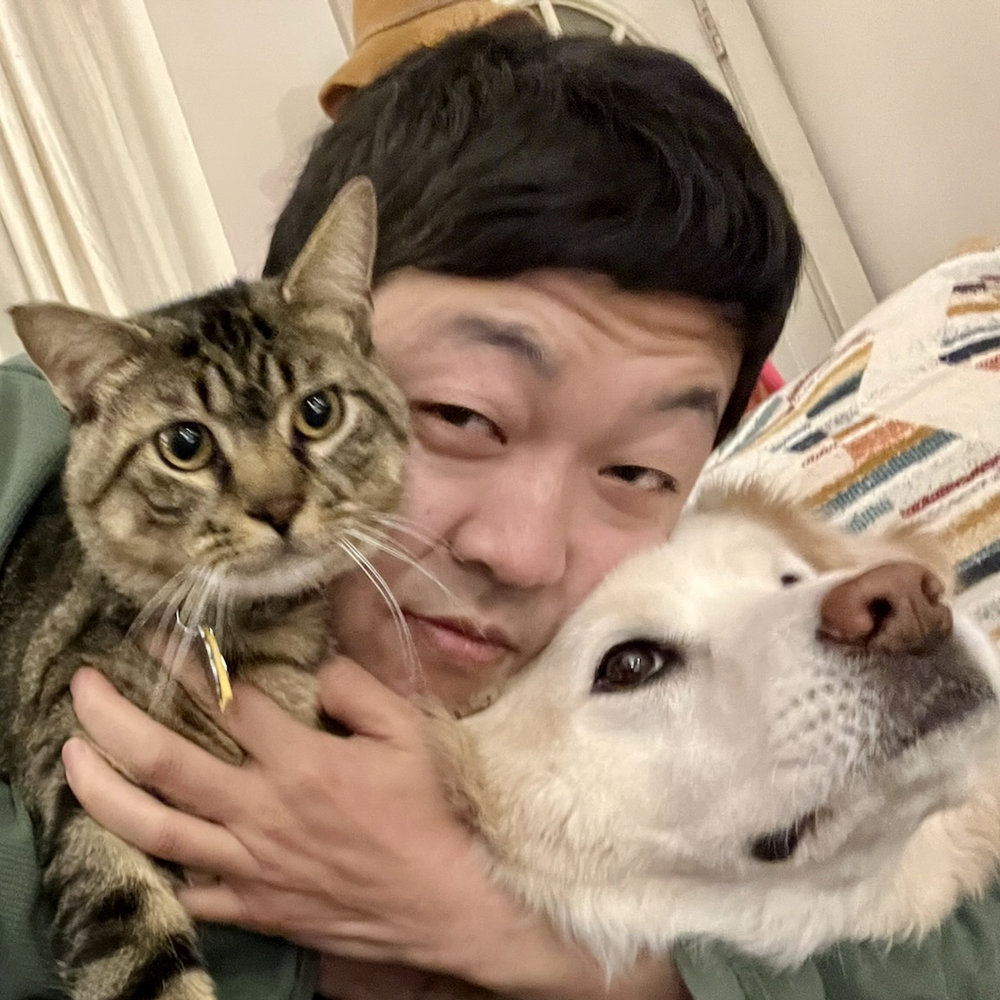

I am the Computational Sciences Librarian at Princeton University, and serve as the library's liaison for the Computer Science and Electrical & Computer Engineering departments.

Broadly speaking, I am interested in reforming research systems to be more humane, welcoming, inclusive, and equitable. This manifests in work around:

* open research (sometimes referred to as "open science")
* researcher training (e.g. around rigor, reproducibility, open practices)
* labor conditions and incentive alignment

My primary motivation is to use my expertise to solve interesting and impactful problems, with the goal of making academia and society more inclusive and open. After many years spent working on data and software, I have become more intentionally collaborative to tackle these larger scale problems. I enjoy working with other people on initiatives, so [get in touch](../contact) if you want to chat!

## Education

<i class="fas fa-graduation-cap pr2"></i>Ph.D. in Oceanography &#8729; University of California San Diego / Scripps Institution of Oceanography &#8729; 2015

<i class="fas fa-graduation-cap pr2"></i>M.S. in Oceanography &#8729; University of California San Diego / Scripps Institution of Oceanography &#8729; 2011

<i class="fas fa-graduation-cap pr2"></i>M.A. in Psychology &#8729; University of California San Diego &#8729; 2007

<i class="fas fa-graduation-cap pr2"></i>B.S. in Computer Science &#8729; California Institute of Technology &#8729; 2006

## Affiliations

Data Paper Editor &#8729; [Ecology](https://esajournals.onlinelibrary.wiley.com/journal/19399170)

Code of Conduct committee &#8729; [Reproducibility 4 Everyone](https://www.repro4everyone.org/)

Instructor, Instructor Trainer &#8729; [The Carpentries](https://carpentries.org/)

## Past Work and Affiliations

Curriculum Lead &#8729; [Community for Rigor](https://c4r.io/)

Reproducibility Librarian &#8729; University of Florida

Governance Committee &#8729; [OLS](https://openlifesci.org/)

Associate Editor &#8729; Methods in Ecology & Evolution

Selection Committee &#8729; Code for Science & Society, Event Fund

## Pets

My partner and I have a dog, Falafel, and a cat, Capers.

## Old Website

Looking for the previous version of my website? It can be found at https://github.com/ha0ye/personal-website